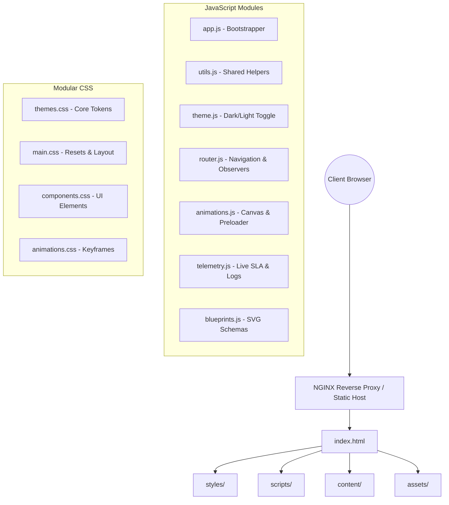

# Enterprise SRE & Cloud Operations Portfolio

[](https://github.com/raghav-sudharsan/sudharsan-sre/actions)
[](https://github.com/raghav-sudharsan/sudharsan-sre)
[](https://www.docker.com/)
[](https://opensource.org/licenses/MIT)

An enterprise-grade, high-observability, responsive portfolio platform tailored for Site Reliability Engineers, DevOps Architects, and Cloud Operations Leaders. Featuring dynamic system telemetry feeds, live SLA tickers, modular client-side scripting, animated vector architecture diagrams, and custom print layouts.

---

## 1. System & Architecture Overview

The application is structured as a static, single-page client dashboard optimized for rapid loading, robust execution, and high security. It uses a modular frontend architecture, separating content data, helper functions, visual styling, page behavior, and container operations.



---

## 2. Technology Stack

- **Core**: HTML5, Vanilla JavaScript (ES6 Modules)
- **Styling**: Vanilla CSS3, Grid/Flexbox layouts, Glassmorphism, Print Media rules
- **Icons**: [Lucide Icons](https://lucide.dev/) (Pinned Stable CDN)
- **Markdown Parsing**: [Marked.js](https://marked.js.org/) (Pinned Stable CDN)
- **Containerization**: Docker, NGINX Alpine, Docker Compose
- **Pipeline Operations**: GitHub Actions, static linters

---

## 3. Folder Structure

```
/
├── index.html                  # Main application dashboard layout
├── server.js                   # Lightweight Node.js local runner (fallback)
├── Dockerfile                  # Multi-stage production container manifest
├── docker-compose.yml          # Local container run orchestrator
├── nginx.conf                  # Hardened production server parameters
│
├── styles/
│   ├── themes.css              # Typography, HSL tokens, and light mode overrides
│   ├── main.css                # Base setup, main grids, and media breakpoints
│   ├── components.css          # Form inputs, modals, slider, timeline, and print rules
│   └── animations.css          # Preloader, status pulses, and viewport reveals
│
├── scripts/
│   ├── app.js                  # DOM Bootstrapper and initialization runner
│   ├── utils.js                # State management, validators, and toast manager
│   ├── theme.js                # Dark / Light theme applicator
│   ├── router.js               # Smooth scrolling and view observers
│   ├── animations.js           # Terminal loader sequence, background canvas particles
│   ├── telemetry.js            # Decimal uptime ticker, simulated operations logs
│   └── blueprints.js           # Dynamic SVG generator and magnifier zoom
│
├── content/
│   ├── profile.js              # Personal biography, strengths, avatar configurations
│   ├── skills.js               # Skill list categories and metrics level percentage
│   ├── experience.js           # Professional career operations history
│   ├── projects.js             # Project case studies metadata
│   ├── certifications.js       # Accreditations targets
│   ├── achievements.js         # Core metrics and SRE SLA highlights
│   └── contact.js              # Recruiter details, endorsements, blog posts
│
├── assets/
│   ├── images/                 # Avatar photographs and diagrams
│   │   └── Sudharsan_SRE.jpeg  # Profile avatar image
│   ├── documents/              # Stored resumes/CVs (PDFs)
│   ├── icons/                  # Local SVGs/Favicon files
│   └── svg/                    # Custom system flow graphics
│
├── tests/
│   └── test_strategy.md        # Operations validation plan
│
└── .github/
    └── workflows/
        └── deploy.yml          # Static analysis, security audit, and packaging
```

---

## 4. Feature Set & SRE Widgets

1. **Simulated Terminal Preloader**: Loads platform configurations sequentially (AWS, IIS, Prometheus) before presenting the dashboard.
2. **Operations Board (Sidebar)**: Real-time telemetry log printing simulated server metrics, combined with cloud and operating systems metrics.
3. **Live SLA Decimal Ticker**: Heartbeat uptime ticker fluctuating above `99.999%` to simulate live service availability checks.
4. **Architecture Blueprint Magnifier**: Fully pannable and zoomable vector (SVG) diagram viewer allowing recruiters to examine network topologies.
5. **Resume ATS/GUI Switch**: Toggles CV view between styled graphical presentation and raw monospaced raw text.
6. **Smart Testimonials Slider**: Touch-sweep enabled slide carousel displaying reviews, with manual button override that resets the rotation timers.
7. **Telemetry Gateway (Contact)**: Multi-field validator checking corporate email and logging submissions into localStorage.

---

## 5. Development Guide

### Running Locally
To run the SRE portfolio on your local system:

#### Option A: Native Node Server (If Node is installed)
```bash
node server.js
```
Open your browser to `http://localhost:8000/`.

#### Option B: Python Server (If Python is installed)
```bash
python -m http.server 8000
```
Open your browser to `http://localhost:8000/`.

---

## 6. Containerization (Docker)

The portfolio is fully containerized using a multi-stage Docker setup and served using NGINX on Alpine Linux.

### Building and Running with Docker:
```bash
# Build the container image
docker build -t sre-portfolio:latest .

# Run the container mapping host port 80
docker run -d -p 80:80 --name sre-portfolio sre-portfolio:latest
```

### Running with Docker Compose:
```bash
# Build and launch in background
docker-compose up -d --build
```
Access the application on `http://localhost/` (default port 80).

### NGINX Optimizations Explained:
- **Gzip Compression**: Compresses text assets (HTML, CSS, JS, SVG) on the fly, reducing transfer size.
- **Security Headers**:
  - `Content-Security-Policy`: Restricts scripts and styles to self and verified secure CDNs, mitigating XSS.
  - `X-Frame-Options (DENY)`: Block clickjacking attacks by preventing frame embedding.
  - `X-Content-Type-Options (nosniff)`: Blocks browser MIME-type sniffing.
  - `Strict-Transport-Security (HSTS)`: Forces SSL traffic for client connections.
- **Aggressive Caching**: Sets static assets (images, fonts, stylesheets, scripts) to expire in 6 months (`Cache-Control: immutable`), maximizing client-side performance.
- **Health Check Endpoint**: Bundles `/healthz` returning `200 OK` for load balancer or Kubernetes probe checks.

---

## 7. CI/CD Pipeline

The GitHub Actions workflow under `.github/workflows/deploy.yml` enforces enterprise deployment quality gates:

```
[Developer Push / PR]
       │
       ▼
┌─────────────────────────────┐
│ 1. Static Analysis (Lints)  │
│    - HTML Validation        │
│    - JS Code Quality        │
└──────────────┬──────────────┘
               │
               ▼
┌─────────────────────────────┐
│ 2. Security Scan            │
│    - Dockerfile Audit       │
└──────────────┬──────────────┘
               │
               ▼
┌─────────────────────────────┐
│ 3. Build Verification       │
│    - Docker compilation     │
└──────────────┬──────────────┘
               │
               ▼
┌─────────────────────────────┐
│ 4. Package Release Artifact │
│    - Compress release pack  │
│    - Archive binary file    │
└─────────────────────────────┘
```

### Deployment Strategy
- **PR Gate**: Runs analysis and compilation checks. Must pass before merging is permitted.
- **Main Deployment**: Merges trigger packaging, packaging a versioned tarball `sre-portfolio-v{build_number}.tar.gz` ready to deploy on S3, GitHub Pages, or container registries.

---

## 8. Content Maintenance

All biography, certifications, and portfolio details are managed as structured configurations under the `content/` folder. This separates static code files from data.

### To Update Experience or Skills:
1. Open [content/skills.js](file:///c:/GitRepo/sudharsan-sre/content/skills.js) or [content/experience.js](file:///c:/GitRepo/sudharsan-sre/content/experience.js).
2. Edit the structured objects (categories, percentages, role points).
3. The app bootstrapper (`scripts/app.js`) automatically parses and injects these configurations during page initialization.

---

## 9. Security & Accessibility

- **Accessibility**: Includes focus borders, proper semantic DOM hierarchy, and `prefers-reduced-motion` media queries that automatically disable transitions and canvas grids for users with motion sensitivity.
- **Security Checkpoints**: Links targeting `_blank` include `rel="noopener noreferrer"` to prevent window hijackings. Dynamic contact messages are parsed safely, minimizing XSS pathways.
- **No Unsafe innerHTML**: Content values are injected using `.innerText` to protect against script execution vulnerabilities.

---

## 10. License

This repository is distributed under the **MIT License**. See [LICENSE](file:///c:/GitRepo/sudharsan-sre/LICENSE) for more information.
