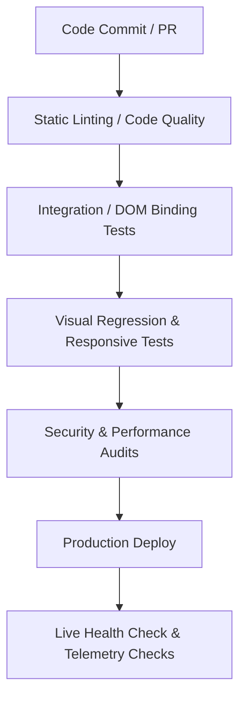

# SRE Portfolio Test Strategy & Production Validation Checklist

This document details the quality assurance, static validation, dynamic testing, and post-deployment validation plan for the SRE Portfolio application.

---

## 1. Multi-Tier Testing Strategy

### Tier 1: Static Analysis & Code Quality
- **HTML Check**: HTMLHint is used to parse `index.html` to find unclosed tags, attributes formatting errors, or broken HTML standards.
- **JavaScript Checking**: ESLint parsing to check for syntax correctness, code standards, anti-patterns, and unused variables.
- **Hadolint Dockerfile Audit**: Checks Docker configuration against performance and security best practices (avoiding root user runtime, pinning base images, minimizing layer count).

### Tier 2: Functional Integration Testing
- **DOM Event Binding validation**: Ensure the event listeners for modals, zoom controls, navigation sliders, and theme toggling bind cleanly after the `DOMContentLoaded` event finishes.
- **Dynamic Content Injection checks**: Verify `portfolioData` structures contain non-null items and map correctly into the DOM cards on runtime load.

### Tier 3: Visual & Cross-Browser Verification
- Verify the portfolio renders correctly across different layout sizes:
  - **Desktop (>= 1200px)**: Grid sidebar layout.
  - **Tablet (768px - 1023px)**: Responsive layout adjustments.
  - **Mobile (< 768px)**: Single column overlay layout.
- Test compatibility on modern engines: Blink (Chrome, Edge), Gecko (Firefox), and WebKit (Safari).

---

## 2. Production Verification Checklist (Release Sanity Checklist)

Before releasing a build package to production hosting environments, SREs must manually verify each point of this checklist:

### A. Preloader and Dashboard Core
- [ ] **Terminal Preloader Sequence**: Preloader appears on page launch, prints simulated command lines sequentially, and fades out within 3 seconds.
- [ ] **Dynamic SLA Ticker**: Uptime ticker starts and fluctuates within the `99.9990%` to `100.000%` range every 3.5 seconds.
- [ ] **Telemetry Feed Console**: Operations feed on the left sidebar prints live SRE success/warning entries sequentially.
- [ ] **Zero Console Errors**: Open browser devtools, confirm `0 errors` and `0 warnings` are registered.

### B. Navigation & Theme Configuration
- [ ] **Smooth Scrolling**: Clicking navigation menu items (About, Skills, Projects, etc.) scrolls the page smoothly to the correct section.
- [ ] **Active Tab Highlighter**: Scrolling through sections automatically updates the active class highlight on the nav bar menu items.
- [ ] **Light Mode Switch**: Toggling light mode updates theme tokens across all card surfaces, grids, and backgrounds without visual bugs.

### C. Blueprint & Magnifier Modals
- [ ] **Default Diagram Render**: The architecture blueprint container renders `Production IIS Architecture` automatically on page load.
- [ ] **Tab Swapping**: Clicking tab controls switches schema graphics and text seamlessly.
- [ ] **Blueprint Zoom Overlay**: Maximizer icon button opens the Magnifier modal, presenting the detailed SVG blueprint.
- [ ] **Scale Controls**: Zoom In (+), Zoom Out (-), and Reset buttons update SVG dimensions cleanly.
- [ ] **Viewport Drag Panning**: Grabbing and dragging inside the magnifier body pans the zoomed diagram.

### D. Data Forms & Dynamic Modals
- [ ] **Case Studies Explorer**: Clicking "Explore Details" on projects expands the detail overlay modal showing business problems, stack, and results.
- [ ] **Telemetry Blog Posts**: Clicking "Deploy Markdown" parse-renders blog content under markdown headings.
- [ ] **Form Validations**: Submitting empty entries triggers warning classes on inputs and displays error labels.
- [ ] **Form Dispatch Success**: Submitting valid corporate emails and messages triggers the central toast notification and resets the form.
- [ ] **Testimonials Carousel**: Arrow keys and Touch sweeps successfully slide client recommendations.
- [ ] **ATS Toggle Switch**: ATS raw mode renders raw copy cleanly, and switches back without layout disruption.
